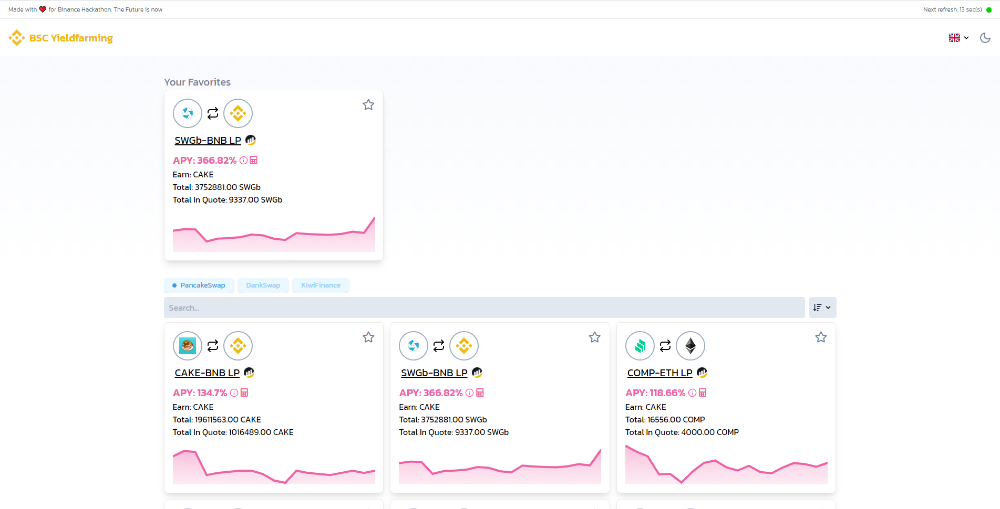

# BSC Yieldfarming Dashboard



## Made with ❤️ from scratch for Binance Hackathon: The Future is now

I created the BSC Yieldfarming Dashboard because I was missing a better overview of the active yieldfarms on the Binance Smart Chain. Coinmarketcap is already providing a nice interface but it's missing a history feature where it shows the past APYs and also it does not update live.

The dashboard has a lot features which I also listed below. It was my first project in the crypto world and I really enjoyed making it!

<br></br>
# Features
### 🕑 **Updates live every 60 seconds**
### 📈 **See history APYs for the last 30 days for each farm**
### ⭐ **Mark farms as favorite to have them displayed on the top**
### 📱 **Works perfectly on all mobile devices**
### ➕ **Calculate earnings for different farms**
### 🌐 **Translated into multiple languages (currently 2)**
### ⬇️ **Sorting options**
### 🔗 **Supports multiple different farm "providers" (currently 3)**
### 🔍 **Quickly search for a specific farm**
### 🌗 **Darkmode**
### ♿ **Focused on accessibility**

<br></br>
# Build Setup

## Client

```bash
# install dependencies
$ yarn install

# serve with hot reload at localhost:3000
$ yarn dev

# build for production and launch server
$ yarn build
$ yarn start

# generate static project
$ yarn generate
```

## Server

```bash
# install dependencies
$ yarn install

# serve with hot reload at localhost:8080
$ yarn run dev

# build for production and launch server
$ tsc
$ node dist/index.js
```